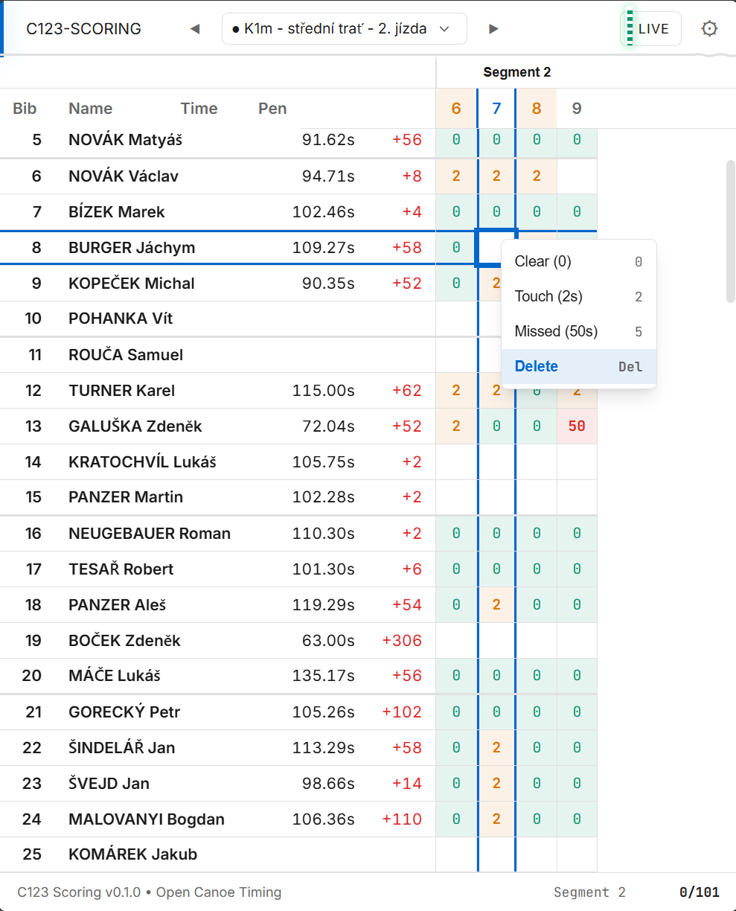

# C123 Penalty Check

Web application for penalty verification and correction in canoe slalom timing with Canoe123 system.

| Dark Mode | Tablet Layout |
|:---------:|:-------------:|
|  |  |

## Overview

C123 Penalty Check is a React-based web application designed for ergonomic penalty verification during canoe slalom competitions. It connects to c123-server which bridges communication with the Canoe123 timing system.

### Key Features

- **Real-time updates** via WebSocket connection
- **Keyboard-driven interface** for efficient data entry
- **Gate grouping** for segment-based penalty verification
- **Protocol checking** to track verification progress
- **Touch-friendly UI** with accessibility support

## Architecture

```
c123-penalty-check (this app)
    │
    ├─► WebSocket ws://server:27123/ws  (real-time data)
    │     - OnCourse, Results, RaceConfig, Schedule
    │
    └─► REST API http://server:27123/api/c123/*  (write operations)
          - POST /api/c123/scoring
          - POST /api/c123/remove-from-course
          - POST /api/c123/timing
```

## Prerequisites

- Node.js 20+
- Running c123-server instance (see [c123-server](../c123-server/))
- Canoe123 timing software (connected to c123-server)

## Installation

```bash
npm install
```

## Development

```bash
# Start development server
npm run dev
```

The app runs at `http://localhost:5173` by default.

### With c123-server

```bash
# Terminal 1: Start c123-server
cd ../c123-server
npm start

# Terminal 2: Start c123-penalty-check
cd ../c123-penalty-check
npm run dev
```

### Testing with sample data

For testing without live Canoe123, use static XML or replay recordings:

```bash
# Option A: Static XML (shows final race state)
cd ../c123-server
npm start -- --xml ../c123-protocol-docs/captures/xboardtest02_jarni_v1.xml

# Option B: Replay recording (simulates live race)
cd ../c123-protocol-docs/tools
node replay-server.js ../recordings/rec-2025-12-28T09-34-10.jsonl

# Then in another terminal:
cd ../c123-server
npm start -- --host localhost
```

## Build

```bash
# Production build
npm run build

# Preview production build
npm run preview
```

Output is in the `dist/` directory.

## Keyboard Shortcuts

### Navigation
| Key | Action |
|-----|--------|
| Arrow keys | Navigate grid cells |
| Tab / Shift+Tab | Move left/right |
| Home / End | First / last column |
| Ctrl+Home / End | First / last row |
| Page Up / Down | Jump 10 rows |

### Penalty Entry
| Key | Action |
|-----|--------|
| 0 | Clear (0 penalty) |
| 2 | Touch (2 seconds) |
| 5 or 50 | Missed gate (50 seconds) |
| Delete / Backspace | Clear penalty |
| Enter | Confirm edit |
| Escape | Cancel edit |

### Application
| Key | Action |
|-----|--------|
| 0 | Show all gates (when not in cell) |
| 1-9 | Switch gate groups |
| Ctrl+, | Open settings |
| D | Competitor actions menu |
| ? or F1 | Show keyboard help |

## Configuration

Settings are stored in localStorage. Configure via Settings panel (Ctrl+,):

- **Server URL**: WebSocket server address (default: `ws://localhost:27123`)
- **Display options**: Theme (auto/light/dark), show start times
- **Gate groups**: Custom gate groupings for segment-based verification

## Project Structure

```
src/
├── components/          # React components
│   ├── CheckProgress/   # Verification progress indicator
│   ├── CompetitorActions/  # DNS/DNF/CAP actions
│   ├── ConnectionStatus/   # Server connection indicator
│   ├── EmptyState/      # Empty state displays
│   ├── ErrorBoundary/   # Error handling
│   ├── GateGroupEditor/ # Gate group configuration
│   ├── Header/          # App header with race selector
│   ├── Layout/          # Main layout
│   ├── OnCourseGrid/    # On-course competitors grid
│   ├── RaceSelector/    # Race/category selection dropdown
│   ├── ResultsGrid/     # Main penalty grid with results
│   ├── Settings/        # Settings panel
│   ├── SortSelector/    # Results sorting options
│   ├── TimingPanel/     # Manual timing controls
│   └── Toast/           # Notification toasts
├── hooks/               # React hooks
│   ├── useC123WebSocket.ts    # WebSocket connection
│   ├── useCheckedState.ts     # Verification state
│   ├── useConnectionStatus.ts # Connection status
│   ├── useFocusNavigation.ts  # Grid navigation
│   ├── useFocusTrap.ts        # Modal focus management
│   ├── useGateGroups.ts       # Gate grouping with segments
│   ├── useKeyboardInput.ts    # Keyboard handling
│   ├── useSchedule.ts         # Race schedule parsing
│   ├── useScoring.ts          # Scoring API
│   └── useSettings.ts         # App settings
├── services/            # API services
│   ├── coursesApi.ts    # Course segments API
│   └── scoringApi.ts    # Scoring REST API
├── types/               # TypeScript types
│   ├── c123server.ts    # WebSocket message types
│   ├── gateGroups.ts    # Gate group types
│   ├── scoring.ts       # Scoring types
│   └── ui.ts            # UI state types
└── utils/               # Utility functions
    └── gates.ts         # Gate parsing utilities
```

## Related Projects

- [c123-server](https://github.com/OpenCanoeTiming/c123-server) - WebSocket bridge to Canoe123
- [c123-scoreboard](https://github.com/OpenCanoeTiming/c123-scoreboard) - Live results display
- [timing-design-system](https://github.com/OpenCanoeTiming/timing-design-system) - UI components
- [c123-protocol-docs](https://github.com/OpenCanoeTiming/c123-protocol-docs) - Protocol documentation

## License

MIT License - see [LICENSE](LICENSE) for details.

---

Part of [OpenCanoeTiming](https://github.com/OpenCanoeTiming) project.
